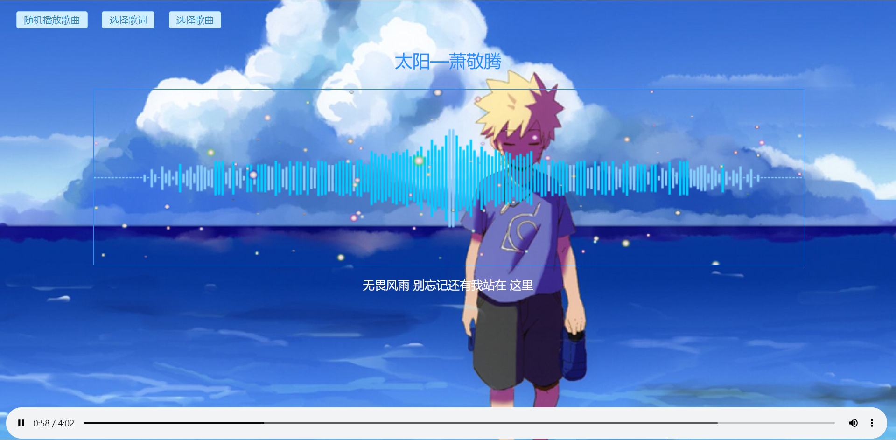

# Computer-Graphics
> Fdu Computer Graphics projects

## Project 1 

> 代码仅供参考

[demo](https://syz913.github.io/music.html)

效果图
- 基本功能，歌词仅支持 lrc 格式，可以 F12 获取

- 新增随机播放、随机切换背景图、生成气泡功能
- 优化频谱图的显示

## Project 1 
使用 OpenGL

效果图

## Project 3
使用 Flash CS6 Pro

version 1: 简单的实现了灯泡、蜡烛燃烧、闪电的动画

version 2: 上一个太无聊，做了火柴人打斗的动画，因为水平不行，所以异常粗糙

